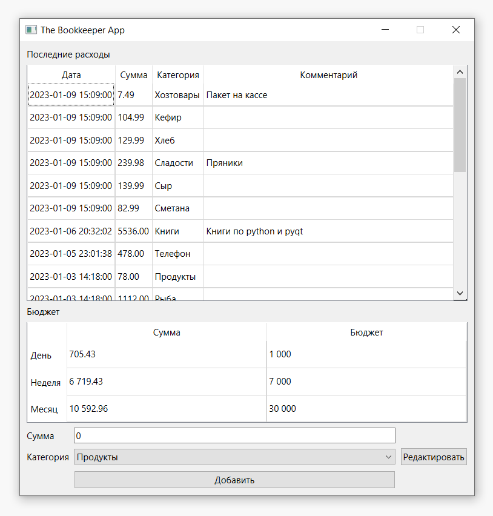

# Программа для управления личными финансами
#### (учебный проект для курса по практике программирования на Python)

[Техническое задание](specification.md)

Прежде чем приступать к разработке проекта, определитесь, как вы будете работать с данными. Допускаются следующие варианты:

1. непосредственное обращение к БД SQLite через библиотеку `sqlite3` с написанием SQL-запросов;
1. использование библиотеки ORM (PonyORM, SQLAlchemy);
1. разработка собственного механизма для взаимодействия с БД в соответствии с паттерном «репозиторий».

Здесь приведены примеры кода для ознакомления с третьим вариантом работы с БД. Рекомендуем опробовать этот код на своем компьютере и затем выбрать подход, который подходит вам. 

Также в этой заготовке кода задана предпочтительная структура файлов и каталогов (модулей и пакетов), которая отражает архитектуру проекта:

📁 bookkeeper — исполняемый код 

- 📁 models — модели данных

    - 📄 budget.py — бюджет
    - 📄 category.py — категория расходов
    - 📄 expense.py — расходная операция
- 📁 repository — репозиторий для хранения данных

    - 📄 abstract_repository.py — описание интерфейса
    - 📄 memory_repository.py — репозиторий для хранения в оперативной памяти
    - 📄 sqlite_repository.py — репозиторий для хранения в sqlite (пока не написан)
- 📁 view — графический интерфейс (пока не написан)
- 📄 simple_client.py — простая консольная утилита, позволяющая посмотреть на работу программы в действии
- 📄 utils.py — вспомогательные функции

📁 tests — тесты (структура каталога дублирует структуру bookkeeper)

Для работы с проектом склонируйте этот код через `git` на свой компьютер. Все комментарии об особенностях своей разработки пишите в файл `README.md`.

Проект создан с помощью `poetry`. Убедитесь, что система `poetry` у вас установлена. Инструкцию по установке можно посмотреть [здесь](https://python-poetry.org/docs/).

Если возникли проблемы с `poetry`, можно создать виртуальное окружение через `virtualenv` и установить необходимые зависимости через `pip`. В этом случае обязательно укажите в файле `README.md` своего проекта, как запускать вашу программу.

Для установки всех зависимостей через `poetry` запустите следующую команду (убедитесь, что вы находитесь
в корневой папке проекта — там, где лежит файл pyproject.toml):

```commandline
poetry install
```

Для запуска тестов и статических анализаторов используйте следующие команды (убедитесь, 
что вы находитесь в корневой папке проекта):
```commandline
poetry run pytest --cov
poetry run mypy --strict bookkeeper
poetry run pylint bookkeeper
poetry run flake8 bookkeeper
```

При проверке работы будут использоваться эти же инструменты с теми же настройками.

Задача первого этапа:
1. Сделать клон проекта из GitHub
2. Если решите реализовать паттерн «репозиторий», написать класс SqliteRepository и написать тесты к этому классу
3. Если используете ORM, создать модели для основных сущностей
4. Если обращаетесь напрямую к БД через SQL, добавить в проект SQL-файл для создания необходимых таблиц
5. (Опционально, не влияет на оценку.) Подключить СУБД sqlite к simple_client (пока он работает в оперативной памяти и все забывает при выходе)

Задача второго этапа:
1. Создать виджеты:
   - для отображения списка расходов с возможностью редактирования
   - для отображения бюджета на день/неделю/месяц с возможностью редактирования
   - для добавления нового расхода
   - для просмотра и редактирования списка категорий
2. Собрать виджеты в главное окно

В итоге окно должно выглядеть примерно так:



Воспроизводить данный дизайн в точности не требуется, вы можете использовать другие
виджеты и другую раскладку. Дизайн, представленный на скриншоте, предполагает, что 
редактирование списка категорий будет выполняться в отдельном окне. Вы можете
сделать так же, а можете все разместить в одном окне, использовать вкладки
или контекстные меню. Важно только реализовать функциональность.

Задачей этого этапа не является подключение реальной логики приложения и базы
данных. Пока нужно только собрать интерфейс. Файлы, описывающие интерфейс,
должны располагаться в папке bookkeeper/view.

Задача 3 этапа:
1. Написать тесты для графического интерфейса (опционально)
2. Реализовать архитектуру Model—View—Controller или создать компонент Presenter модели Model—View—Presenter, тем самым соединив все компоненты
в работающее приложение. Вопрос архитектуры остается на ваш выбор

Итогом 3 этапа должно быть полностью работающее приложение, реализующее всю требуемую
функциональность.

Задача 4 этапа:
1. Доделать, отладить и привести в порядок все, что было сделано на предыдущих этапах
2. Добавить стилизацию (не влияет на оценку)
3. Добавить дополнительные функции (не влияет на оценку). Например:
    - возможность задать бюджет на день с переносом остатка на следующий день
    - формирование отчета за произвольный период
    - интерактивная визуализация данных в отчете
    - возможность добавления чека по qr-коду или скану
    - и т. д.

Реализация дополнительных функций и стилизация приложения не влияют на оценку, поэтому
сосредоточиться следует на том, чтобы основная функциональность хорошо работала
и код был хорошо написан.

Для сдачи работы достаточно прислать ссылку на свой проект на GitHub в форму «Добавить ответ на задание» в ЛМС, 
pull-request создавать не надо.
